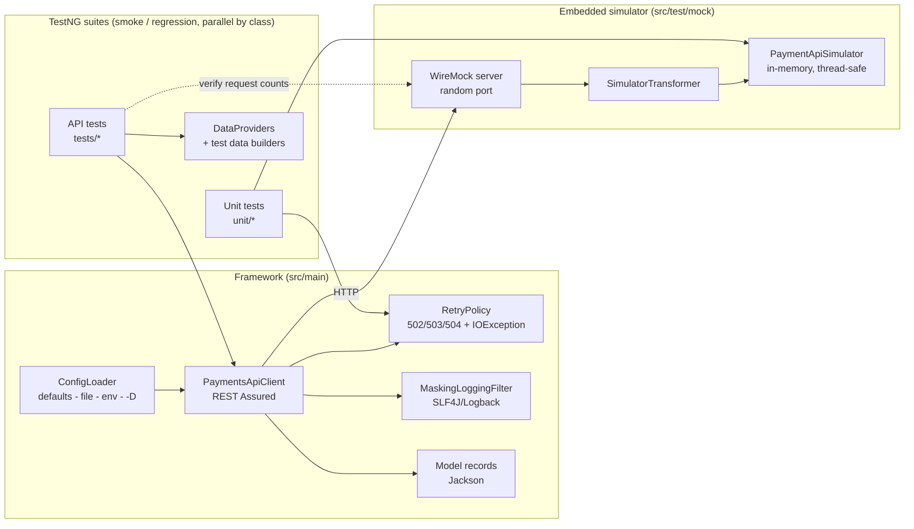

# Payments API Test Framework

[](https://github.com/lmohan2562-hub/payments-api-test-framework/actions/workflows/ci.yml)


A Java 17 REST API test framework for a **synthetic payment authorization and refund API**. It is
built with REST Assured, TestNG, Jackson, AssertJ and JSON Schema validation. An embedded WireMock
server simulates the API, so the whole suite runs offline, needs no credentials and gives the same
result on every run.

> **Representative portfolio project built independently with synthetic data. It does not contain
> code or data from any employer or client.**

---

## Business use case

Card payment APIs carry money. When they misbehave, the costs are real: a customer charged twice,
a refund larger than the original charge, a decline code mapped wrongly, or a log line that leaks
cardholder data. This framework shows how a QA team can protect a payments service. It checks:

| Risk | How the suite covers it |
|---|---|
| Double charge on client retry | Idempotency-key replay, key reuse conflict (409), retry-after-timeout returns the original result |
| Incorrect issuer decline handling | Data-driven decline-code matrix (51, 05, 54, 59, 61) |
| Accepting bad input | 13-case validation DataProvider, malformed JSON, multi-error reporting |
| Accepting raw card numbers | API must reject PAN-like values and never echo them back |
| Refunding more than captured | Partial, full, over-refund (422), refund of declined auth (409), currency mismatch |
| Unauthenticated access | Missing or invalid bearer token returns 401, checked before validation |
| Unannounced contract changes | JSON Schema (draft-04, `additionalProperties: false`) for success and error envelopes |
| Transient gateway failures | 503 retried automatically, read timeouts bounded, request counts checked in WireMock's journal |
| Sensitive data in logs | Masking filter on every request and response, with unit tests |

## Architecture



**Request lifecycle:** a test builds a request with `AuthorizationRequestBuilder` (synthetic token,
random amount and reference). `PaymentsApiClient` adds the bearer token, the `Idempotency-Key` and a
correlation id. `RetryPolicy` runs the call. `MaskingLoggingFilter` writes one masked, logfmt-style
line per exchange. WireMock routes the request to `PaymentApiSimulator`, which holds the API's state
(authorizations, refund balances, idempotency store). Tests then assert on typed records with AssertJ.

## Tech stack

| Concern | Choice |
|---|---|
| Language / build | Java 17, Maven 3.9 |
| HTTP testing | REST Assured 5.5 |
| Test runner | TestNG 7.10 (groups, DataProviders, parallel classes, suite listeners) |
| Serialization | Jackson 2.17 (Java records) |
| Assertions | AssertJ 3.26, Hamcrest (schema matcher) |
| Contract | REST Assured `json-schema-validator` (JSON Schema draft-04) |
| Service virtualization | WireMock 3.9 (standalone, embedded) with a custom `ResponseDefinitionTransformerV2` |
| Logging | SLF4J 2 + Logback 1.5 (structured key=value lines, masked) |
| Reporting | Surefire XML, TestNG HTML, `target/reports/surefire.html` |
| CI/CD | GitHub Actions, Jenkins (declarative), Docker |

## Project structure

```
payments-api-test-framework/
├── .github/workflows/ci.yml           # GitHub Actions: mvn -B verify, uploads reports
├── Jenkinsfile                        # Declarative pipeline with suite parameter
├── Dockerfile                         # Containerised test run
├── config.example.properties          # Template for local overrides (git-ignored copy)
├── pom.xml
└── src
    ├── main
    │   ├── java/io/github/lehamohan/payments
    │   │   ├── client/    PaymentsApiClient, RetryPolicy, ApiTransportException
    │   │   ├── config/    FrameworkConfig (record), ConfigLoader (layered)
    │   │   ├── data/      SyntheticToken, AuthorizationRequestBuilder, IdempotencyKeys
    │   │   ├── logging/   SensitiveDataMasker, MaskingLoggingFilter
    │   │   └── model/     Request/response records (Money, AuthorizationRequest, ...)
    │   └── resources/config/default.properties
    └── test
        ├── java/io/github/lehamohan/payments
        │   ├── mock/      PaymentApiSimulator, SimulatorTransformer, PaymentsMockServer
        │   ├── support/   TestEnvironment (suite listener), BaseApiTest
        │   ├── tests/     Authorization, Decline, Idempotency, Validation, Authentication,
        │   │              SchemaContract, Refund, Resilience, HealthCheck
        │   └── unit/      Masker, ConfigLoader, RetryPolicy, Simulator
        └── resources
            ├── schemas/   authorization-, refund-, error-response.schema.json
            ├── suites/    regression.xml, smoke.xml
            └── logback-test.xml
```

## Synthetic API contract

| Method & path | Outcomes |
|---|---|
| `POST /v1/authorizations` | `201` approved, `402` declined, `400` validation, `401`, `409` key reuse, `503` transient |
| `GET /v1/authorizations/{id}` | `200`, `401`, `404` |
| `POST /v1/authorizations/{id}/refunds` | `201`, `400`, `401`, `404`, `409` not refundable, `422` exceeds remaining |
| `GET /v1/health` | `200` (plain WireMock stub) |

Each synthetic token (`SyntheticToken` enum) triggers one fixed behaviour:

| Token | Behaviour |
|---|---|
| `tok_test_visa_approved`, `tok_test_mc_approved` | Approved |
| `tok_test_decline_insufficient_funds` | Declined `51` |
| `tok_test_decline_do_not_honor` | Declined `05` |
| `tok_test_decline_expired_card` | Declined `54` |
| `tok_test_decline_suspected_fraud` | Declined `59` |
| any token, amount > 1,000,000 minor units | Declined `61` (limit) |
| `tok_test_flaky_gateway` | `503` on the first attempt per idempotency key, then approved |
| `tok_test_slow_gateway` | Approved after a 1.5 s delay (used for timeout tests) |

## Setup

Prerequisites: **JDK 17+** and **Maven 3.9+**. Nothing else is needed, because the API simulator is embedded.

```bash
git clone https://github.com/lmohan2562-hub/payments-api-test-framework.git
cd payments-api-test-framework
mvn -B verify
```

Optional local overrides:

```bash
cp config.example.properties config.properties   # git-ignored
```

## How to run

### Local

```bash
mvn -B verify                         # full regression suite (default)
mvn -B verify -Dsuite=smoke           # smoke gate only
mvn -B verify -Dpayments.retry.max.attempts=1    # any config key can be overridden with -D
```

To point at a real sandbox instead of the simulator, supply its URL and token through the environment.
Do not put them in files:

```bash
export PAYMENTS_BASE_URL=https://sandbox.example.test
export PAYMENTS_API_TOKEN=...   # from your secret manager
mvn -B verify -Dsuite=smoke
```

Tests that read WireMock's request journal (`ResilienceTest`) are skipped automatically when no simulator is running.

### Docker

```bash
docker build -t payments-api-tests .
docker run --rm -v "$PWD/target:/workspace/target" payments-api-tests              # regression
docker run --rm -v "$PWD/target:/workspace/target" payments-api-tests -Dsuite=smoke
```

### CI

* **GitHub Actions** (`.github/workflows/ci.yml`) runs `mvn -B verify` on every push to `main` and on every pull request,
  using Temurin 17 and a Maven cache. Surefire XML, TestNG HTML and run logs are uploaded as the
  `test-reports` artifact, even when tests fail. A manual dispatch lets you choose the suite.
* **Jenkins** (`Jenkinsfile`) uses a `SUITE` choice parameter, publishes JUnit results and archives reports and logs.

### Reports and logs

| Output | Location |
|---|---|
| Surefire XML (CI-friendly) | `target/surefire-reports/` |
| TestNG HTML | `target/surefire-reports/index.html`, `emailable-report.html` |
| Surefire HTML summary | `target/reports/surefire.html` |
| Structured run log (masked headers and bodies at DEBUG) | `target/logs/test-run.log` |

## Sample output

From the first GitHub Actions run (`mvn -B verify`, JDK 17, ubuntu-latest, 8 Oct 2026):

```
[INFO] Tests run: 75, Failures: 0, Errors: 0, Skipped: 0, Time elapsed: 4.624 s -- in TestSuite
[INFO] Results:
[INFO] Tests run: 75, Failures: 0, Errors: 0, Skipped: 0
[INFO] BUILD SUCCESS
```

The suite is designed to run **60 test methods / 75 test invocations** in the regression suite
(including 4 decline-code rows and 13 validation rows from DataProviders), and 8 in the smoke suite.

A masked log line looks like this (format from `logback-test.xml`):

```
ts=... level=INFO  thread=TestNG-test=regression-2 logger=payments.http event=http_exchange method=POST path=/v1/authorizations status=201 durationMs=12 idempotencyKey=idem-...
ts=... level=DEBUG ... event=http_request_headers headers={Accept=application/json, ..., Authorization=Bearer ****, Idempotency-Key=idem-...}
ts=... level=DEBUG ... event=http_request_body body={"merchantId":"MRC-TEST-0001","amount":{"value":2599,"currency":"USD"},"paymentToken":"****oved",...}
```

## Design decisions

* **The simulator is pure Java, wrapped by WireMock.** `PaymentApiSimulator` knows nothing about HTTP,
  so its behaviour is unit-tested on its own (`PaymentApiSimulatorTest`). That keeps the test double
  from drifting away from the contract it stands in for. WireMock supplies the real HTTP layer,
  fixed delays and a request journal.
* **The client handles transport, the tests handle assertions.** `PaymentsApiClient` returns the raw
  REST Assured `Response`, so negative tests can assert on any status. Typed records are used only
  when a test wants them.
* **Idempotency keys make retries safe.** Every `POST` sends an `Idempotency-Key`, and only then
  does `RetryPolicy` retry 5xx responses and timeouts. `retryAfterTimeoutIsSafeBecauseOfIdempotency`
  proves end to end that a timed-out authorization is replayed rather than charged twice.
* **Request counts come from WireMock's journal.** Resilience tests assert how many requests actually
  reached the server, not only the final status.
* **Configuration is layered.** The order is classpath defaults, then an optional local file, then
  environment variables, then `-D` properties. `FrameworkConfig` is an immutable, validated record,
  and its `toString()` never prints the token.
* **Tests can run in parallel.** The client is immutable, every test generates unique keys and
  references, and the simulator uses concurrent maps with per-key and per-authorization locking.
  TestNG runs classes on 4 threads, and decline rows run in parallel within their DataProvider.
* **Builders keep tests readable.** `anAuthorization().withToken(EXPIRED_CARD).build()` states only
  what the test cares about. Every other field gets a valid default.

## Security considerations

* **Synthetic data only.** Payment tokens are opaque `tok_test_*` strings. No real or Luhn-valid
  card numbers appear anywhere. Merchant ids and references are made up.
* **No secrets in the repo.** The only token value is a placeholder that only the embedded simulator
  accepts. Real tokens must come from `PAYMENTS_API_TOKEN` (a CI secret or Jenkins credential).
  `config.properties` and `.env` are git-ignored.
* **Masking.** `SensitiveDataMasker` hides sensitive JSON fields (`paymentToken`, `cardNumber`,
  `cvv`, ...), any 13 to 19 digit PAN-like run, and the `Authorization` / API-key / cookie headers.
  Only the last 4 characters are kept, for correlation. REST Assured's raw `log().all()` is
  deliberately not used.
* **Behaviour tests cover security.** The API must reject raw card numbers, must not echo them in
  errors, and must check authentication before validation. These are tested like any other requirement.
* **Least privilege in CI and Docker.** The workflow has `contents: read` permissions and the
  container runs as a non-root user.
* A secret scan (detect-secrets) was run over the full git history before publishing.

## Limitations and future enhancements

* The simulator keeps all state in memory and models one region and one capture mode (auth-only).
  Capture/void, multi-currency FX and 3-D Secure are not modelled.
* JSON Schema checks are consumer-side only. A next step is consumer-driven contracts (Pact) that
  are verified against the provider build.
* Retry backoff is linear, with no jitter. Exponential backoff with jitter and a circuit breaker
  would be closer to production clients.
* Possible additions: Allure reporting with request/response attachments, a performance smoke
  (Gatling or k6) against the same simulator, mutation testing of the simulator, and an
  OpenAPI-first contract from which both schemas and stubs are generated.

## License

[MIT](LICENSE) © 2026 Leha Mohan
